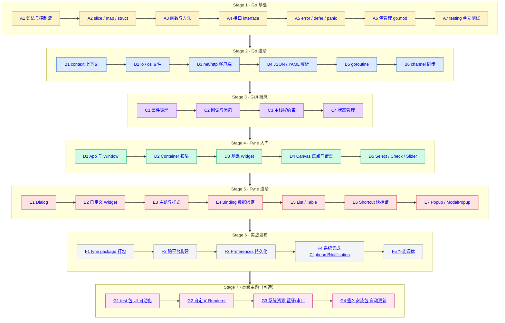

# Go + Fyne 学习路线图

> 风格对标 [roadmap.sh](https://roadmap.sh) —— 阶段化、由浅入深、每个主题可点击进入独立学习卡片，附官方资源、动手练习与完成标准。
> 目标读者：会用 Go 写控制台程序、想转 GUI 桌面开发的工程师。

## 路线总览

> 说明：每个节点都可点击跳转到下方对应主题卡片；卡片包含“学习内容、官方资源、动手练习、完成标准”四块。

---

## Stage 1 · Go 基础（1-2 周）

**目标**：能独立写 200-500 行的 Go 程序，熟悉 Go 风格。

### A1 语法与控制流

- **学习内容**：`var`/`const`、`if`/`for`/`switch`、`range`、`defer`（基础用法）、基本类型与零值。
- **官方资源**：[Go Tour · Basics 1](https://go.dev/tour/basics/1)
- **动手练习**：写一个命令行猜数字游戏（`bufio.Scanner` 读输入，`math/rand` 出题，循环直到猜对）。
- **完成标准**：能不看文档写出 50 行带循环和分支的小程序。

### A2 slice / map / struct

- **学习内容**：`make`/`append`、map 增删查、struct 嵌套、struct tag、`nil` vs 空 slice。
- **官方资源**：[Go Tour · More Types](https://go.dev/tour/moretypes/1)
- **动手练习**：实现一个 `PhoneBook`：用 map 存 name→number，支持 add / lookup / list / delete；用 slice 实现 list 返回有序结果。
- **完成标准**：清楚 `nil map` 写入会 panic、`nil slice` 可以 append 的差异；能熟练写 struct tag。

### A3 函数与方法

- **学习内容**：多返回值、命名返回值、方法接收者（值 vs 指针）、闭包作为函数返回值。
- **官方资源**：[Go Tour · Methods](https://go.dev/tour/methods/1)
- **动手练习**：为上面 PhoneBook 的 `map[string]string` 写方法：`Add`、`Lookup`（返回 `(string, bool)`），区分值接收者和指针接收者。
- **完成标准**：能说清“大 struct 应该用指针接收者避免拷贝”的原因。

### A4 接口 interface

- **学习内容**：隐式实现、空接口、类型断言、`io.Reader/Writer`、`error` 接口。
- **官方资源**：[Go Tour · Interfaces](https://go.dev/tour/methods/9)
- **动手练习**：为 PhoneBook 抽 `Store interface { Add/Remove/Lookup }`，用 mock 实现写一组测试。
- **完成标准**：能解释“Go 接口的隐式实现是鸭子类型”。

### A5 error / defer / panic

- **学习内容**：`errors.New`/`fmt.Errorf`、`fmt.Errorf("...: %w", err)`、`errors.Is/As`、`defer` 顺序、`panic`/`recover`。
- **官方资源**：[Go Tour · Errors & defer/panic](https://go.dev/tour/methods/19)
- **动手练习**：把 PhoneBook 操作改为返回 `error`，用 `%w` 包装底层错误；写一个会在 panic 时 recover 的 demo。
- **完成标准**：能写出 `func foo() (err error) { defer func() { if err != nil { log.Println("foo failed:", err) } }(); ... }` 这种带错误日志 defer 的模式。

### A6 包管理 go.mod

- **学习内容**：`go mod init`、`go get`、`go mod tidy`、`go.sum`、`replace` 指令、semver（`v1.2.3` 与 `v0` 主版本）。
- **官方资源**：[Go · Managing dependencies](https://go.dev/doc/modules/managing-dependencies)
- **动手练习**：建一个新 module，加入 `gopkg.in/yaml.v3` 依赖，写代码读 `data.yml`；再用 `replace` 指向本地 fork 路径。
- **完成标准**：能不看文档完成 `go mod tidy`、加新依赖、清理无用依赖。

### A7 testing 单元测试

- **学习内容**：`_test.go`、`func TestXxx(t *testing.T)`、表格驱动测试、`t.Run`、`t.Helper`、`httptest`。
- **官方资源**：[pkg.go.dev · testing](https://pkg.go.dev/testing)
- **动手练习**：把 PhoneBook 的所有方法用表格驱动测试覆盖（输入、期望、错误信息）；加一个 `httptest` 跑通的最小 HTTP handler 测试。
- **完成标准**：能用表格驱动测试写出 3 个以上 case 的测试函数。

---

## Stage 2 · Go 进阶（1-2 周）

**目标**：能写网络客户端、解析配置文件，能正确处理并发。

### B1 context 包

- **学习内容**：`context.Background`/`WithCancel`/`WithTimeout`/`WithValue`、ctx 沿调用链传递、`Done()` channel。
- **官方资源**：[pkg.go.dev · context](https://pkg.go.dev/context)
- **动手练习**：实现一个带超时的 HTTP 拉取函数：用 `context.WithTimeout` 包住 `http.NewRequestWithContext`，超时后 `ctx.Done()` 触发取消。
- **完成标准**：能说清 ctx 第一个参数传递的重要性，以及为什么不要把 ctx 放进 struct。

### B2 io / os 文件

- **学习内容**：`os.ReadFile/WriteFile`、`bufio.Scanner`、`io.Copy`、目录遍历 `filepath.Walk`。
- **官方资源**：[pkg.go.dev · os](https://pkg.go.dev/os)
- **动手练习**：写一个 `wc` 工具：遍历目录下所有 `.go` 文件，统计行数、字符数、字节数。
- **完成标准**：能用 `defer f.Close()` 配合 `bufio.Scanner` 处理大文件不爆内存。

### B3 net/http 客户端

- **学习内容**：`http.Client`、`http.NewRequest`、`Transport`、`RoundTripper`、超时、重试。
- **官方资源**：[pkg.go.dev · net/http](https://pkg.go.dev/net/http)
- **动手练习**：写一个命令 `fetch <url>`，GET 一个 JSON API（如 `https://api.github.com/repos/golang/go`），解析后打印 stars 与 description；带超时与重试。
- **完成标准**：能自定义 `Transport` 实现指数退避重试；理解 `http.Client` 与默认 `http.Get` 的差别。

### B4 JSON / YAML 解析

- **学习内容**：`json.Marshal/Unmarshal`、`omitempty`、`encoding/json/v2`、YAML v3 的 `Marshal/Unmarshal`、`yaml:"-"` 忽略。
- **官方资源**：[pkg.go.dev · encoding/json](https://pkg.go.dev/encoding/json) · [pkg.go.dev · gopkg.in/yaml.v3](https://pkg.go.dev/gopkg.in/yaml.v3)
- **动手练习**：把 Stage 1 的 PhoneBook 序列化到 YAML 文件，启动时读回内存；再写出对应的 JSON 版本做对比。
- **完成标准**：能熟练使用 struct tag；能用 YAML 的 `Anchor` 与 `Alias` 写复用配置。

### B5 goroutine

- **学习内容**：`go func()` 启动、`sync.WaitGroup`、`sync.Once`、`sync.Mutex`、`runtime.GOMAXPROCS`。
- **官方资源**：[Go Tour · Concurrency](https://go.dev/tour/concurrency/1)
- **动手练习**：写并发 URL 状态检查器：给一组 URL，并发 HEAD 检查是否 200，用 `sync.WaitGroup` 等待全部完成，打印耗时。
- **完成标准**：能用 `sync.Mutex` 保护共享计数器；能解释 goroutine 泄漏的常见模式。

### B6 channel 同步

- **学习内容**：无缓冲 vs 有缓冲 channel、`select` 多路复用、`for v := range ch`、channel 关闭协议。
- **官方资源**：[Go Tour · Concurrency](https://go.dev/tour/concurrency/1)
- **动手练习**：实现一个 `worker pool`：3 个 worker goroutine 从 job channel 读任务，处理后写 result channel，主 goroutine 收齐后退出（用 `sync.WaitGroup` 或关闭 result channel）。
- **完成标准**：能解释“发送方关闭 channel，接收方 range 退出”的协议；能用 `select` 同时监听多个 channel。

---

## Stage 3 · GUI 编程概念（1-3 天）

**目标**：理解 GUI 应用的事件驱动模型 —— 这是从命令行转 GUI 的思维拐点。

### C1 事件循环

- **学习内容**：OS 事件 → 队列 → 派发到回调；GUI 应用“main 返回但不退出”的原因；`ShowAndRun` 的阻塞本质。
- **官方资源**：阅读 [Fyne · Application and RunLoop](https://docs.fyne.io/started/apprun/)（用 Fyne 真实例子理解）。
- **动手练习**：画一个你最熟悉的 GUI 应用（VS Code / 浏览器）的事件流图：用户点击 → 事件入队 → 主循环派发 → 回调触发。
- **完成标准**：能解释为什么 `ShowAndRun()` 必须阻塞、以及阻塞期间 UI 还能响应输入的原因。

### C2 回调与闭包

- **学习内容**：GUI 通过回调函数响应输入；闭包捕获上下文（按钮 handler 里引用外层变量）；避免 goroutine 与 UI 回调的竞态。
- **官方资源**：[Fyne · Widget Guide](https://docs.fyne.io/widget/)（阅读 button 的 `OnTapped` 用法）。
- **动手练习**：写一个 `widget.Button`，handler 闭包捕获一个计数器，每次点击自增并打印。
- **完成标准**：能区分“回调里的变量是值捕获还是引用捕获”。

### C3 主线程约束

- **学习内容**：Windows UI API 要求 UI 操作在创建窗口的线程；Fyne 通过 `fyne.Do` 把任务排到主线程下一帧。
- **官方资源**：[pkg.go.dev · fyne.Do](https://pkg.go.dev/fyne.io/fyne/v2#Do)（搜索 `Do`）。
- **动手练习**：在 Fyne 程序里起一个 goroutine，每秒更新 `widget.Label.Text`，看哪些方式会导致界面不刷新、哪些正常。
- **完成标准**：能解释为什么本仓库 `AGENTS.md` 里弹框 Focus 必须用 `fyne.Do` 包一层。

### C4 状态管理

- **学习内容**：应用数据（业务状态）vs UI 状态（控件当前值）；单向数据流：“数据更新 → 触发 Refresh”。
- **官方资源**：[Fyne · Data Binding](https://docs.fyne.io/binding/data/)（理念基础，不深究 API）。
- **动手练习**：把 Stage 2 的 worker pool 结果用 `widget.List` 展示，点击按钮清空列表 —— 体会“按钮只改数据，列表只反映数据”。
- **完成标准**：能画出“数据 → 绑定 → UI”的单向流图。

---

## Stage 4 · Fyne 入门（3-5 天）

**目标**：能搭一个多控件的窗口应用。

### D1 App 与 Window

- **学习内容**：`app.New()` + `NewWindow` + `ShowAndRun`、`SetOnClosed`、`SetContent`、`Resize`、`CenterOnScreen`。
- **官方资源**：[Fyne · Application and RunLoop](https://docs.fyne.io/started/apprun/) · [Fyne · Windows](https://docs.fyne.io/started/windows/) · [pkg.go.dev · fyne.App](https://pkg.go.dev/fyne.io/fyne/v2#App)
- **动手练习**：写一个最小窗口，标题 `MyApp`、尺寸 `400x300`、居中显示、关闭时打印 `Goodbye`。
- **完成标准**：能区分 `Show()` 与 `ShowAndRun()`；能在关闭事件里释放资源（蓝牙、文件句柄等）。

### D2 Container 布局

- **学习内容**：`VBox`/`HBox`/`Grid`/`GridWithColumns`/`Border`/`Center`/`Max`/`Padded`，布局嵌套实现复杂 UI。
- **官方资源**：[Fyne · Container & Layout](https://docs.fyne.io/container/) · [Fyne · Layouts](https://docs.fyne.io/explore/layouts/) · [pkg.go.dev · container](https://pkg.go.dev/fyne.io/fyne/v2/container)
- **动手练习**：用嵌套布局搭一个“两行三列”设置面板：第一行左边 Label、右边 Entry；第二行两个按钮居右。
- **完成标准**：能用 `Border` 做到“中间自适应、上下固定”——这是表单类 UI 的核心布局。

### D3 基础 Widget

- **学习内容**：`Label`/`Button`/`Entry`（含 `PasswordEntry`/`MultiLineEntry`）/`Checkbox`/`Hyperlink`。
- **官方资源**：[Fyne · Widget Guide](https://docs.fyne.io/widget/) · [Fyne · Entry](https://docs.fyne.io/widget/entry/) · [pkg.go.dev · widget](https://pkg.go.dev/fyne.io/fyne/v2/widget)
- **动手练习**：做一个登录表单：账号 `Entry` + 密码 `PasswordEntry` + 登录按钮；点击后用 `widget.Label` 显示结果。
- **完成标准**：能解释 `widget.Entry` 的 `OnChanged` 与 `OnSubmitted` 的区别。

### D4 Canvas 焦点与键盘

- **学习内容**：`Canvas.Focus(widget)`、`fyne.Focusable` 接口、`SetOnTypedKey`/`SetOnKeyDown`、弹框打开后用 `fyne.Do` 延迟 focus。
- **官方资源**：[Fyne · Focusable](https://docs.fyne.io/api/v2/fyne/focusable/) · [pkg.go.dev · FocusManager](https://pkg.go.dev/fyne.io/fyne/v2#FocusManager) · [Fyne · KeyEvent](https://docs.fyne.io/api/v2/fyne/hardwarekey/)
- **动手练习**：在 Stage 4 D3 的登录表单上实现：账号输入后按 Enter 自动跳到密码框（用 `OnSubmitted` + `Canvas.Focus`）；Esc 清空两个 Entry。
- **完成标准**：理解本仓库 `cmd/test/main.go` 里 Popup 关闭的 Esc/Enter/Space 三键实现原理。

### D5 Select / Check / Slider

- **学习内容**：`Select`（下拉单选）、`RadioGroup`（单选组）、`Check`（多选）、`Slider`（数值滑块）的用法与 `OnChanged` 回调。
- **官方资源**：[Fyne · Widget Guide](https://docs.fyne.io/widget/) · [pkg.go.dev · widget](https://pkg.go.dev/fyne.io/fyne/v2/widget)
- **动手练习**：做一个“字体大小设置”：用 `Slider` 选 8-72 之间字号，实时刷新右侧 `Label` 的字号。
- **完成标准**：能熟练用 `OnChanged` 做实时 UI 联动；知道 `Select` 改成可编辑需要 `Entry` 自定义。

---

## Stage 5 · Fyne 进阶（1-2 周）

**目标**：能写出复杂交互的多窗口应用。

### E1 Dialog

- **学习内容**：`dialog.NewConfirm`/`NewCustom`/`NewCustomConfirm`/`NewForm`/`NewFileOpen`/`NewFileSave`/`NewEntryDialog`、`NewForm` 自动 focus。
- **官方资源**：[Fyne · Dialog](https://docs.fyne.io/dialog/) · [Fyne · Dialogs](https://docs.fyne.io/explore/dialogs/) · [pkg.go.dev · dialog](https://pkg.go.dev/fyne.io/fyne/v2/dialog)
- **动手练习**：做一个“新建项目”弹框：`Entry` 输入项目名 + `Select` 选项目类型 + 确定/取消；按确定后用 `widget.Label` 显示创建结果。
- **完成标准**：能区分 `NewCustom` 和 `NewForm` 的 focus 行为差异（参考本仓库 `AGENTS.md`）。

### E2 自定义 Widget

- **学习内容**：实现 `fyne.Widget` 接口的两种方式 —— 直接实现接口 vs `ExtendBaseWidget` 简化；自定义 `Renderer` 控制 `MinSize/Layout/Paint/Refresh`。
- **官方资源**：[Fyne · Custom Widget](https://docs.fyne.io/extend/custom-widget/) · [Fyne · Extending Widgets](https://docs.fyne.io/extend/extending-widgets/)
- **动手练习**：实现一个 `StatusDot`：画一个圆点，颜色由状态字段决定（绿/黄/红），提供 `SetStatus(Status)` 方法触发刷新。
- **完成标准**：能用 `ExtendBaseWidget` 写一个少于 50 行的自定义 Widget。

### E3 主题与样式

- **学习内容**：`theme.DefaultTheme`/`DarkTheme`、自定义 `fyne.Theme` 接口、`TextStyle{Bold:true}`、`Importance=HighImportance`。
- **官方资源**：[Fyne · Custom Theme](https://docs.fyne.io/extend/custom-theme/) · [pkg.go.dev · theme](https://pkg.go.dev/fyne.io/fyne/v2/theme) · [Fyne · Theme FAQ](https://docs.fyne.io/faq/theme/)
- **动手练习**：做一个“暗色模式切换”按钮：点击调用 `app.Settings().SetTheme(theme.DarkTheme())`，整个应用立即切色。
- **完成标准**：能解释主题如何影响 Fyne 的图标与默认色；能写一个最小自定义主题改变 primary color。

### E4 Binding 数据绑定

- **学习内容**：`binding.NewString/Int/Bool`、`widget.Entry.Bind(binding)`、`binding.DataListener`、列表绑定 `NewListWithData`。
- **官方资源**：[Fyne · Data Binding](https://docs.fyne.io/binding/data/) · [Fyne · Two-way Binding](https://docs.fyne.io/binding/twoway/) · [Fyne · List Binding](https://docs.fyne.io/binding/list/)
- **动手练习**：做一个“实时计数器”：用 `binding.NewInt` 存数值，Label 绑定显示，按钮 `OnTapped` 自增；开两个窗口都能看到同步变化。
- **完成标准**：理解“数据驱动 UI”模式；能用 `Bind` 把 Entry 与变量双向同步。

### E5 List / Table

- **学习内容**：`widget.List`（虚拟滚动）、`widget.Table`（二维）、自定义 cell renderer、`CreateItem`/`UpdateItem`。
- **官方资源**：[Fyne · List](https://docs.fyne.io/collection/list/) · [Fyne · Table](https://docs.fyne.io/collection/table/) · [pkg.go.dev · widget.List](https://docs.fyne.io/api/v2/widget/list/)
- **动手练习**：用 `widget.List` 展示 10 万行随机数据，滚动观察内存稳定；再用 `widget.Table` 做一个 100x100 的乘法表。
- **完成标准**：能解释 List 为何不卡顿（虚拟化）；能用 Table 自定义 cell 内容。

### E6 Shortcut 快捷键

- **学习内容**：`fyne.Shortcut` 接口、`&desktop.CustomShortcut{Ctrl,Key}`、`Window.Canvas().AddShortcut`、全局快捷键（Windows `Ctrl+C/V`、macOS `Cmd+C/V`）。
- **官方资源**：[Fyne · Shortcuts](https://docs.fyne.io/explore/shortcuts/) · [pkg.go.dev · ShortcutHandler](https://docs.fyne.io/api/v2/fyne/shortcuthandler/) · [pkg.go.dev · CustomShortcut](https://docs.fyne.io/api/v2/driver/desktop/customshortcut/)
- **动手练习**：给登录表单加 `Ctrl+Enter` 触发登录、`Esc` 清空、`Ctrl+S` 保存到文件。
- **完成标准**：能在不依赖 widget 焦点的情况下，让任意时刻 `Ctrl+S` 都生效（理解全局 vs 局部快捷键的差异）。

### E7 Popup / ModalPopup

- **学习内容**：`widget.NewPopUp`/`NewModalPopUp`、弹框内容、键盘交互（默认不响应 Esc/Enter）、`fyne.Do` 延迟 Focus。
- **官方资源**：[Fyne · PopUp](https://docs.fyne.io/widget/popup/) · [pkg.go.dev · widget.PopUp](https://docs.fyne.io/api/v2/widget/popup/) · [pkg.go.dev · widget#PopUp](https://pkg.go.dev/fyne.io/fyne/v2/widget#PopUp)
- **动手练习**：把 `cmd/test/main.go` 弹框改成支持 Esc / Enter / Space 关闭，并在弹框打开时自动 Focus 到 Close 按钮（参考本仓库踩坑）。
- **完成标准**：能在不查文档的情况下，给任意 `widget.PopUp` 加上键盘 Esc 关闭能力。

---

## Stage 6 · 实战发布（3-5 天）

**目标**：把应用打包成可分发的安装包。

### F1 fyne package 打包

- **学习内容**：`fyne package -os windows -icon icon.png`、生成 .exe / .app / .tar.gz、`FyneApp.toml` 元数据、版本号。
- **官方资源**：[Fyne · Packaging](https://docs.fyne.io/started/packaging/) · [Fyne · Metadata](https://docs.fyne.io/started/metadata/) · [pkg.go.dev · fyne CLI](https://pkg.go.dev/fyne.io/fyne/v2/cmd/fyne)
- **动手练习**：把 Stage 5 的登录应用打包成 Windows 单文件 .exe，附 `icon.png`（用 [Fyne 默认图标](https://docs.fyne.io/theme/icons/) 也行）。
- **完成标准**：双击 .exe 能正常启动；图标与元数据正确显示。

### F2 跨平台构建

- **学习内容**：`GOOS`/`GOARCH`、CGO 必要性、`fyne-cross` Docker 化构建、Linux 依赖（gtk/libGL）。
- **官方资源**：[Fyne · Cross Compilation](https://docs.fyne.io/started/cross-compiling/) · [fyne-cross GitHub](https://github.com/fyne-io/fyne-cross)
- **动手练习**：用 `fyne-cross linux` 把应用交叉编译为 Linux 二进制，跑通 Wine 或 Docker 验证启动。
- **完成标准**：理解为什么 Fyne 应用通常需要 CGO；知道 `fyne-cross` 解决了哪些痛点。

### F3 Preferences 持久化

- **学习内容**：`a.Preferences().String/Int/Bool(key)`、自动序列化到 OS 配置目录（`%AppData%` / `~/.config`）、`AddChangeListener`。
- **官方资源**：[Fyne · Preferences](https://docs.fyne.io/explore/preferences/) · [Fyne · Preferences API](https://docs.fyne.io/api/v2/fyne/preferences/) · [pkg.go.dev · Preferences](https://pkg.go.dev/fyne.io/fyne/v2#Preferences)
- **动手练习**：把登录表单的“记住密码”选项用 `Bool` 持久化；下次启动自动勾选。
- **完成标准**：能找到应用实际写入的配置文件位置并手动查看。

### F4 系统集成 Clipboard/Notification

- **学习内容**：`fyne.Clipboard`（`Content()`/`SetContent()`）、`app.SendNotification(title, content)`、`ScheduledNotification` 定时通知。
- **官方资源**：[Fyne · Notification](https://docs.fyne.io/api/v2/fyne/notification/) · [Fyne · ScheduledNotification](https://docs.fyne.io/api/v2/fyne/schedulednotification/) · [pkg.go.dev · Notification](https://pkg.go.dev/fyne.io/fyne/v2#Notification)
- **动手练习**：登录成功后弹一个系统通知（`SendNotification`），失败时把错误信息写入剪贴板。
- **完成标准**：能在 Windows/macOS 看到原生通知；理解 `fyne.Clipboard` 的内容大小限制。

### F5 性能调优

- **学习内容**：避免频繁 Refresh、批量更新、合理用 Container 缓存、`Hide()` 不可见控件、大数据用虚拟化 List。
- **官方资源**：[Fyne · Performance Tips](https://docs.fyne.io/started/performance/)（若文档不全面则参考 Fyne 源码里 `widget.List` 的虚拟化实现）。
- **动手练习**：做一个 1 万行 List，先用普通 VBox 渲染看耗时，再改用 `widget.List` 对比；记录两者的 FPS 与内存。
- **完成标准**：能用 `pprof` 给 Fyne 应用采样，找到 Refresh 热点。

---

## Stage 7 · 高级主题（按需）

不是必学路径，根据业务场景选。

### G1 test 包 UI 自动化

- **学习内容**：`test.NewTheme`/`NewWindow`、`test.Tap`、`test.Type`、`assertEqualImages` 像素比对。
- **官方资源**：[Fyne · Testing](https://docs.fyne.io/started/testing/) · [Fyne · test pkg](https://docs.fyne.io/api/v2/test/pkg/) · [pkg.go.dev · test](https://pkg.go.dev/fyne.io/fyne/v2/test)
- **动手练习**：用 `test.Tap` 模拟点击登录按钮，断言 UI 出现成功 Label。
- **完成标准**：能写至少 3 个 UI 测试覆盖登录主流程。

### G2 自定义 Renderer

- **学习内容**：`fyne.WidgetRenderer` 接口、`MinSize`/`Layout`/`Paint`/`Refresh`、使用 `fyne.Canvas` 绘制。
- **官方资源**：[Fyne · Custom Widget（Renderer 部分）](https://docs.fyne.io/extend/custom-widget/)
- **动手练习**：实现一个能画折线图的 Widget：data 字段是 `[]float64`，Paint 里用 `canvas.Line` 画坐标轴与折线。
- **完成标准**：能解释 Renderer 四个方法各自被何时调用。

### G3 系统资源 蓝牙/串口

- **学习内容**：tinygo bluetooth 真实 BLE、注册表读串口（cgo-free）、goroutine 串行化规避 Windows 崩溃。
- **官方资源**：[tinygo bluetooth](https://github.com/tinygo-org/bluetooth) · 本仓库 `internal/device/bluetooth/`、`internal/serial/` 是真实例子。
- **动手练习**：用本仓库 `wire_valve_bluetooth.go` case 跑 `-mock-bt=true`，验证 mock 数据驱动完整流程。
- **完成标准**：能解释“所有 tinygo 调用投递到专用串行 executor goroutine”的设计动机。

### G4 签名安装包 自动更新

- **学习内容**：Windows 代码签名证书、NSIS / MSI 打包、自动更新（`go-update`）、崩溃上报（Sentry 自建）。
- **官方资源**：[Fyne · Distributing](https://docs.fyne.io/started/distributing)
- **动手练习**：给应用加 `go-update` 库，启动时检查 GitHub Releases 最新版本提示用户升级。
- **完成标准**：理解“代码签名”对 Windows SmartScreen 警告消除的关键作用。

---

## 时间预算

| 阶段    | 预计耗时 | 必备前置 |
| ------- | -------- | -------- |
| Stage 1 | 1-2 周   | 无       |
| Stage 2 | 1-2 周   | Stage 1  |
| Stage 3 | 1-3 天   | Stage 1  |
| Stage 4 | 3-5 天   | Stage 3  |
| Stage 5 | 1-2 周   | Stage 4  |
| Stage 6 | 3-5 天   | Stage 5  |
| Stage 7 | 按需     | Stage 5  |

**总计**：约 **6-8 周** 可掌握 Go + Fyne 实战开发。

---

## 本仓库参考点

- `cmd/test/main.go` — Fyne 弹框/Popup 最小复现 + 键盘交互踩坑（D4、E7 直接对应）。
- `internal/ui/fyne/app.go` — 真实 Fyne GUI 应用（异步弹框通道、配置弹框、Entry 自动 focus）—— E1、E5、E7 综合案例。
- `internal/device/bluetooth/` — tinygo 蓝牙集成（goroutine 串行化规避 Windows 崩溃）—— G3 案例。
- `internal/serial/` — Windows 串口枚举（注册表读取，cgo-free）—— G3 案例。
- `AGENTS.md` — 项目踩坑规则（弹框 Focus、文件名不要 `_test.go` 结尾等）—— 配合 E1、E7 学习。

---

## 学习方法建议

1. **每个节点配 5-20 行最小复现**：Fyne 是“代码即文档”的库，API 命名直觉、IDE 跳转友好。
2. **每完成一个 Stage 就做练习题**：练习题覆盖本阶段所有节点，避免“看懂了写不出来”。
3. **跟着 AGENTS.md 踩坑**：本仓库已记录 Fyne GUI 的常见陷阱（弹框 Focus、`_test.go` 结尾、重构原则）。
4. **遇到卡点直接读源码**：`fyne.io/fyne/v2/widget/button.go` 通常只有 200-300 行，看完就懂为什么 Space 触发、Enter 不触发。
